# Blockchain

Présenté par Wei

  
    Commencer l'expédition technologique <carbon:arrow-right class="inline"/>
  

  <a href="https://github.com/weisrc/present-blockchain" target="_blank" alt="GitHub"
    class="text-xl icon-btn opacity-50 !border-none !hover:text-white">
    <carbon-logo-github />
  </a>

---
layout: image-right
image: https://source.unsplash.com/collection/78480484/1920x1080
---

# Plan 
de l'expédition

**Blockchain**

  - Structure informatique & propriétés
  - Applications
  - Authentication & autorisation
  - Faille

**Preuve de travaille**

  - Fonction de hachages
  - Épreuve à force brute
  - Problème

**Démonstration**

---

# Structure informatique de la blockchain

Une blockchain est une chaîne de bloc...

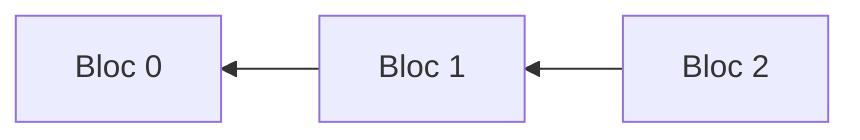

 

# Contenu d'un bloc

| **Enregistré**                                | **Logique**         |
| --------------------------------------------- | ------------------- |
| Empreintre digital (Identité) `nombre`        | Hauteur `nombre`    |
| Empreintre digital du bloc précédent `nombre` | Orphelin? `booléen` |
| Donnés de l'application `quelconque`          | Origine? `booléen`  |
|                                               | Périmé? `booléen`   |
|                                               | Vérifié? `booléen`  |

---

# Example d'une blockchain

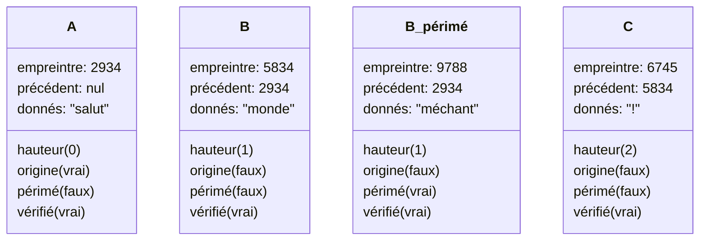

**Blockchain**

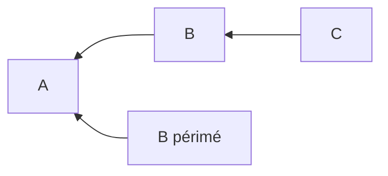

---

# Applications de la blockchain

- Base de donnés parfait pour les banques

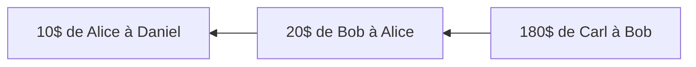

- Détection de corruptions efficace

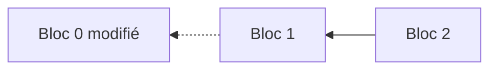

- Consistance d’information éventuelle dans le réseau

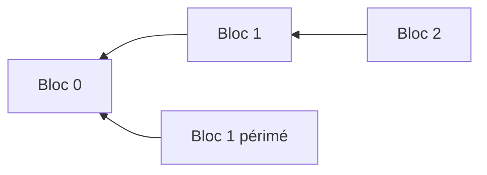

---

# Sécurité centralisée
Comparaison avec l'authentication des applications centralisées:

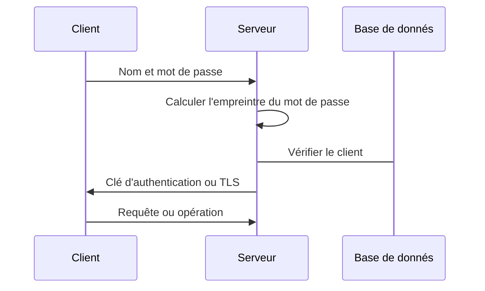
---
layout: image-right
image: https://images.unsplash.com/photo-1633265486064-086b219458ec?ixlib=rb-1.2.1&ixid=MnwxMjA3fDB8MHxwaG90by1wYWdlfHx8fGVufDB8fHx8&auto=format&fit=crop&w=870&q=80
---

# Infrastructure à clés publiques
L'[ICP](https://fr.wikipedia.org/wiki/Infrastructure_%C3%A0_cl%C3%A9s_publiques) est utilisée partout en informatique pour l'encryption asymmétrique.

- Clé privée `nombre`
  - Décrypter les messages `nombres`
  - Signer des messages `nombres`
- Clé publique (identifiant) `nombre`
  - Vérifier les signatures et les messages `nombres`
  - Encrypter des messages `nombres`

---
layout: image-right
image: https://images.unsplash.com/photo-1518133910546-b6c2fb7d79e3?ixlib=rb-1.2.1&ixid=MnwxMjA3fDB8MHxwaG90by1wYWdlfHx8fGVufDB8fHx8&auto=format&fit=crop&w=435&q=80
---

# Les maths de [RSA](https://fr.wikipedia.org/wiki/Chiffrement_RSA)

$$

p \text{ et } q \text{ sont des nombres premier} \\
\therefore p = 3,q = 11\\
n = p*q = 33\\
φ(n) = (p - 1) * (q - 1) = 20\\
1 < e < φ(n), e \text{ est premier avec } φ(n)\therefore e = 7\\
d * e \equiv 1 \pmod{φ(n)}
\therefore d = 3\\
C_{publique} = (e, n) = (7,33)\\
C_{privée} = (d, n) = (3,33)\\
M_{essage} = 2 \therefore E_{ncrypté} = 2^7 \pmod{33} = 29\\
E_{ncrypté} = 29 \therefore M_{essage} = 29^3 \pmod{33} = 2\\

$$

> Il y a également la [cryptography à courbe elliptique](https://fr.wikipedia.org/wiki/Cryptographie_sur_les_courbes_elliptiques) qui est de plus en plus en demande pour sa meilleur sécurité. [AES](https://fr.wikipedia.org/wiki/Advanced_Encryption_Standard) est un algorithme d'encryption symmétrique qui est plus performant.
---

# Sécurité décentralisée
Authentication décentralisée avec clé publique et privée:

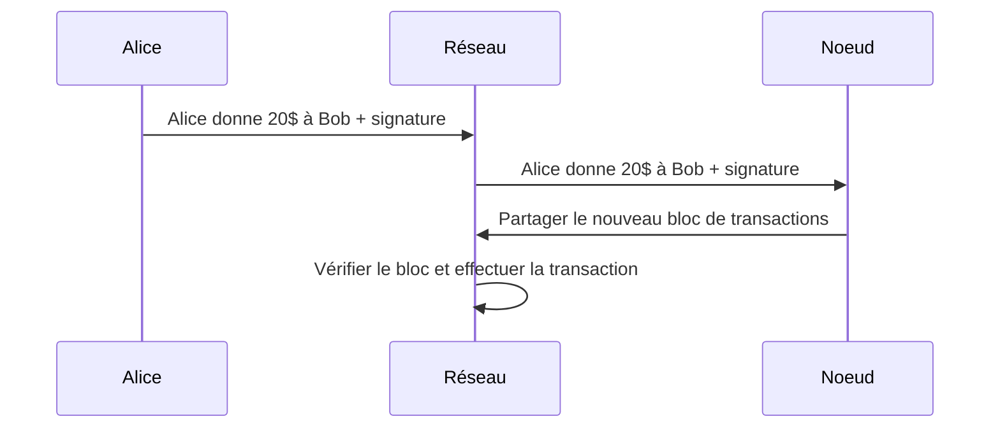

---

# Problème de duplication
Bob peut dupliquer la transation d'Alice autant de fois qu'il désire:

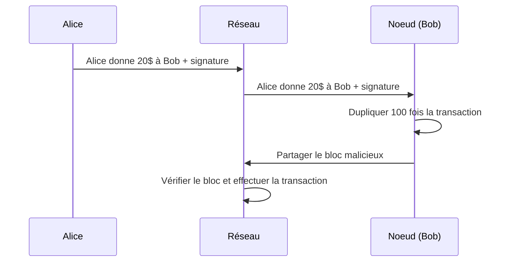

---

# Solution pour dedupliquer
Ajouter un identifiant unique aléatoire (GUID) à chaque transaction:

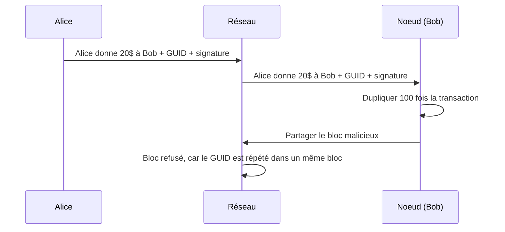

---

# Problème de déception
Alice doit 20000$ à Bob. Alice trompe Bob en disant seulement à lui qu'elle l'a rendu l'argent.

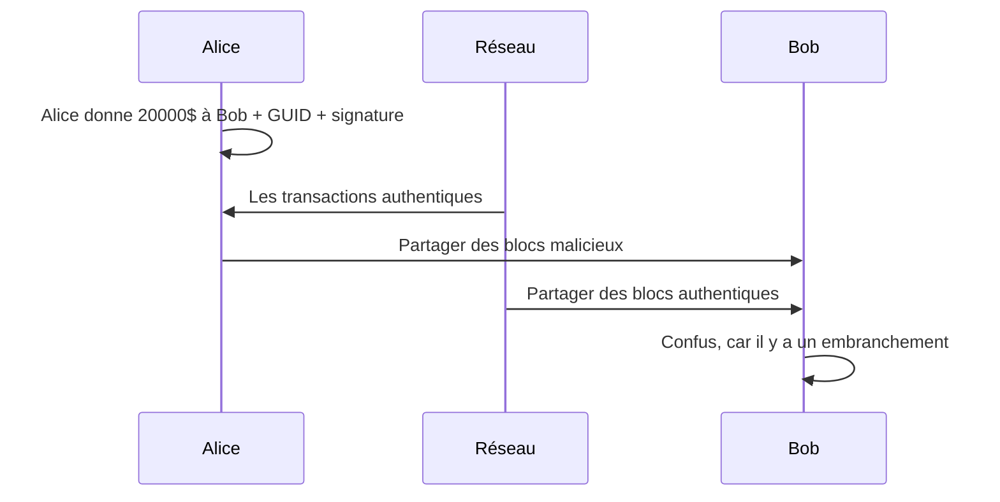

---

# Problème d'embranchements faciles
Bob voit deux embranchements et doit choisir lequel faire confiance.

- Bob va choisir l'embranchement le plus long.
- Par contre, la creation d'un bloc est trop simple pour un ordinateur.
- Ainsi, Alice a la chance de tromper Bob indéfiniment.

 

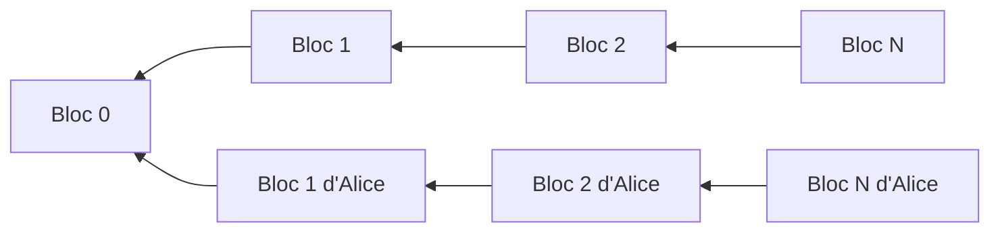

---
layout: image-right
image: https://images.unsplash.com/photo-1504384308090-c894fdcc538d?ixlib=rb-1.2.1&ixid=MnwxMjA3fDB8MHxwaG90by1wYWdlfHx8fGVufDB8fHx8&auto=format&fit=crop&w=870&q=80
---

# La preuve de travail à l'épreuve

- Utilisée contre les pouriels
- Rend une tâche facile pour un ordinateur difficile
- Facile à verifier le *travail*
- Protège les services vulnérables
- Limitation de débit (Rate limiting)

---
layout: two-cols
---

# Les fonctions de hachages

Utilisé pour calculer les empreintres

- Mot de passe
- Vérifier l'intégrité
- Représentation réduite
- *Encryption* (relation) à sens unique
- [SHA (Secure Hash Algorithm)](https://en.wikipedia.org/wiki/Secure_Hash_Algorithms)

**Démonstration mathématique SIMPLIFIÉE:**
$$
M_{essage} \in \N\\
M_{essage} = 1234567890\\
E_{mpreintre} = M_{essage} \pmod {256} = 210\\
E_{mpreintre} \in [0, 255]
$$

::right::

 
 
 
<HashDemo/>
(Toujours 512 bits de long)

---
layout: iframe-right
url: https://www.desmos.com/calculator/hfy3wwphw1
---

# Épreuve à force brute

Ajouter un nombre au message pour que l'empreintre commence avec N zéros.

- Rend la tâche plus difficile
- Essais et erreurs
- Devinettes
- Plus de zéros, plus difficile
- Ajout du nombre dans le bloc
- Bitcoin: ~30 zéros (20 minutes/bloc)

**Probabilité de deviner le bon nombre:**

$P = (\frac{1}{2})^N$

---
layout: cover
background: https://source.unsplash.com/collection/1601131/1920x1080
---

# La vie est belle

### N'est-ce pas?

---
layout: cover
background: https://source.unsplash.com/collection/10041209/1920x1080
---

# La grande faille

---
layout: quote
---

# Faille énergétique

## « Le réseau Bitcoin a une consommation électrique en 2019 entre 30 et 90 TWh par an et a une empreinte carbone de 15 à 40 Mt CO2 eq, comparables à celle de pays comme l’Autriche, la Belgique ou le Danemark. »

<small>

Pierre Boulet. (6 janvier 2022). « Consommation énergétique des technologies blockchain ». HAL Open Science. https://hal.archives-ouvertes.fr/hal-03514983/document

</small>

---
layout: quote
---

# Faille matérielle

## « Dans les 50 prochaines années, nous pourrions produire jusqu’à 1 million de tonnes de déchets électroniques seulement pour le minage du bitcoin. »

— Alex de Vries, économiste

<small>

Binh An Vu Van. (4 avril 2019). « Le bitcoin génère plus de déchets électroniques que le système
bancaire ». Radio Canada. https://ici.radio-canada.ca/nouvelle/1161743/bitcoin-pollution-banques-etude-vries-alex-energie-environnement

</small>

---
layout: cover
---

# Pourquoi?
Gaspiller de l'énergie pour des nombres aléatoires

---
layout: cover
---

# Alternative?
Plus écologique

---
layout: cover
---

# Merci!
Question?

